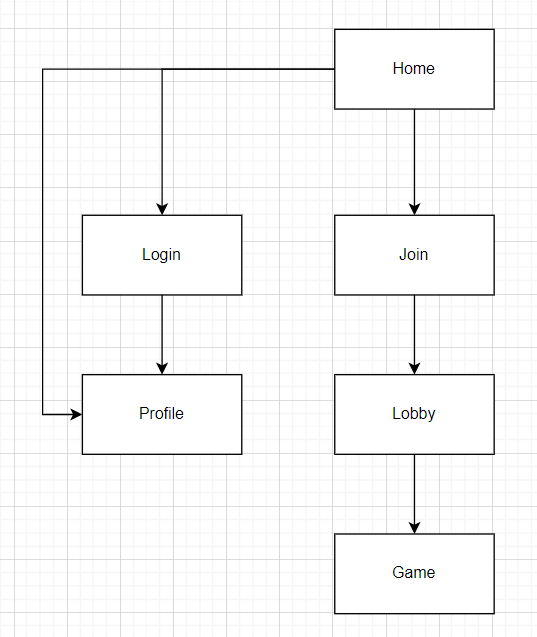

# Love Letter Emulator

## Overview

A website that ports the popular card game, Love Letter, to the web. It will allow players to make accounts and play Love Letter with their friends around the world. It will also keep track of player statistics.

## Data Model

This application will store users and games.
* users will have their game statistics, their username, and their password. The usernames will be unique.
* games will have the current game status, including the players, the deck, and the hands. This will allow for a paused game to continue, and for players to rejoin if they had to close the tab.

An Example User:

```javascript
{
  username: "majikyouser",
  pass: // a password,
  stats:{wins: 3, losses: 7}
}
```

An Example Game:

```javascript
{
  roomcode: "HJKA",
  players: {/*list of usernames, and the card(s) each user has. The list is in the player turn order. The current player's turn is the player with 2 cards in their hand*/},
  deckOfCards: {/*list of card strings*/},
  discardPile: {/*list of discarded card strings*/},
  started: false
}
```

## [Link to Commented First Draft Schema](db.mjs) 

## Wireframes

/ - home page, allowing for users to start new games


/join - page enabling players to join a pre-existing room


/lobby?roomno=____ - a particular game lobby that will enable new users to join the game


/game?roomno=____ - a game room where a game has started and players are playing


/login - page to allow users to log into their account, or create a new account


/profile - the logged in player's profile


## Site map



## User Stories or Use Cases

1. as non-registered user, I can register a new account with the site
2. as a user, I can log in to the site
3. as a user, I can start a new lobby for a game of Love Letter
4. as a user, I can join a pre-existing lobby for the game
5. as a host of a lobby, I can start a game if there is more than one player in the lobby
6. as a player, I can play the game whenever it is my turn by clicking on the card I want to play
7. as a user, I can view my statistics of my wins, losses, and winstreak
8. as a user, at any time there is a question mark button at the bottom of the screen, I can click it to get information on how to play

## Research Topics

* (3 points) socket.io - will use socket.io for the particular actions the user will be sending to the server and the server's response
* (2 points) Bootstrap - will use bootstrap to beautify the website
* (6 points) React - will use react to create the frontend of the app

11 points total out of 10 required points


## [Link to Initial Main Project File](app.mjs) 

## Annotations / References Used

* https://www.youtube.com/watch?v=9AM08OY3usk&t=937s - Used for inspiration
* https://youtu.be/w3vs4a03y3I- for frontend and backend render communication
* https://developer.okta.com/blog/2021/07/14/socket-io-react-tutorial - to learn how to use socket.io with react
* https://www.digitalocean.com/community/tutorials/how-to-add-login-authentication-to-react-applications - to learn how to add authentication
* https://stackoverflow.com/questions/14588032/mongoose-password-hashing - to learn how to hash passwords