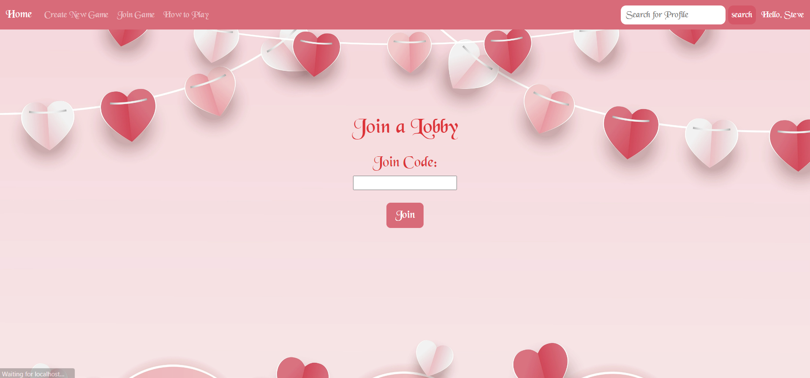
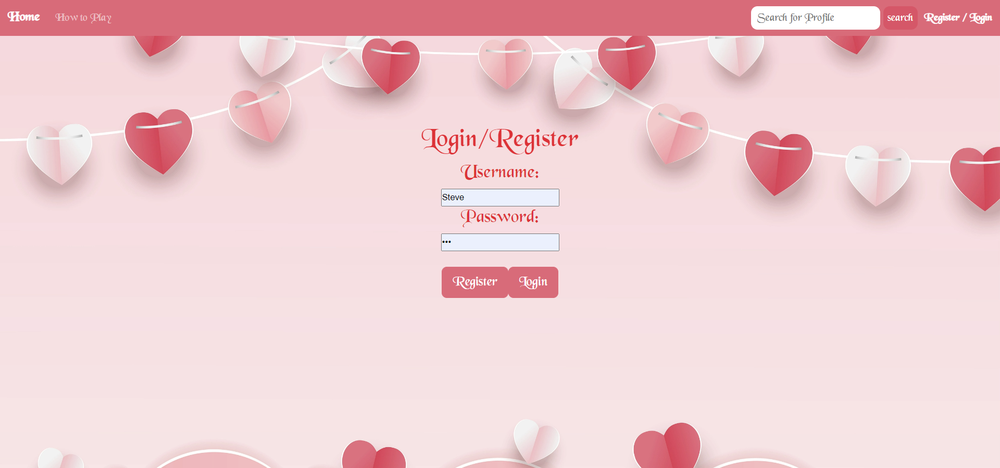

# Love Letter Emulator (Public)
## Overview
link - https://loveletter.herokuapp.com/.
A website that ports the popular card game, Love Letter, to the web. It will allow players to make accounts and play Love Letter with their friends around the world. It will also keep track of player statistics.

## Wireframes

/ - home page, allowing for users to start new games

/join - page enabling players to join a pre-existing room

/lobby?roomno=____ - a particular game lobby that will enable new users to join the game

/game?roomno=____ - a game room where a game has started and players are playing

/login - page to allow users to log into their account, or create a new account

/profile - the logged in player's profile

## [Link to Initial Main Project File](app.mjs) 

## Annotations / References Used

* https://www.youtube.com/watch?v=9AM08OY3usk&t=937s - Used for inspiration
* https://youtu.be/w3vs4a03y3I- for frontend and backend render communication
* https://developer.okta.com/blog/2021/07/14/socket-io-react-tutorial - to learn how to use socket.io with react
* https://www.digitalocean.com/community/tutorials/how-to-add-login-authentication-to-react-applications - to learn how to add authentication
* https://stackoverflow.com/questions/14588032/mongoose-password-hashing - to learn how to hash passwords

## Misc Info
(db.mjs removed for privacy)
